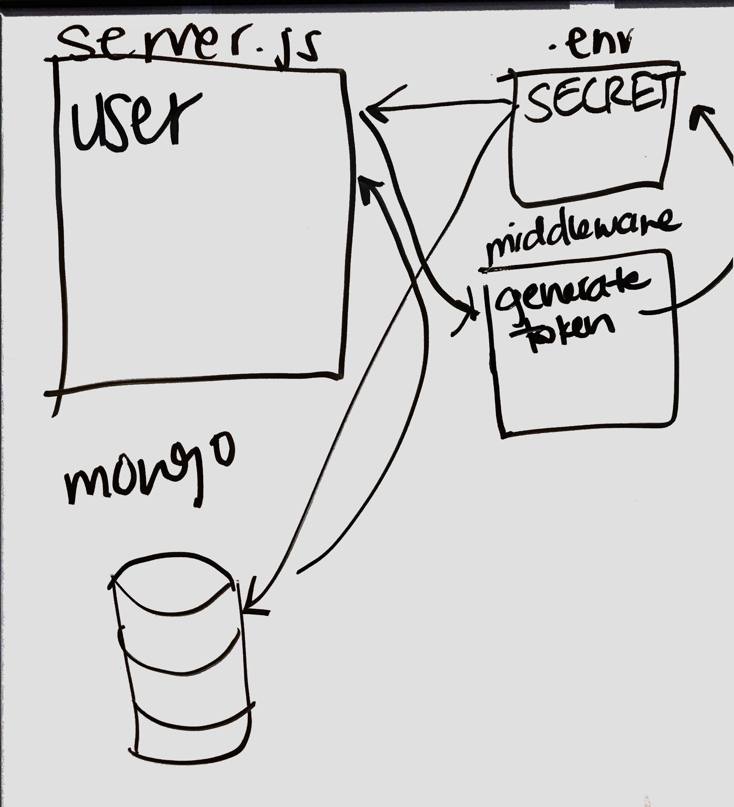
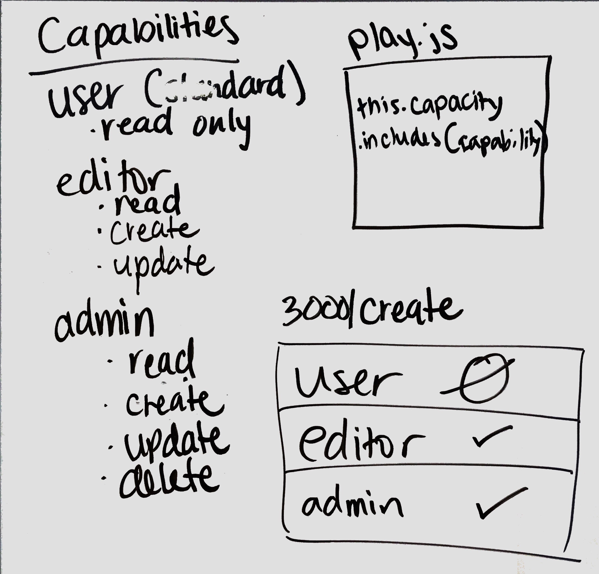

# LAB - 11, 13, & 14

### Author: Jonny Graybill and Adriana Graybill

### Links and Resources
* [submission PR](https://github.com/401-advanced-javascript-jonnygraybill/auth-server/pull/1) 

* [travis]()

### Heroku
* [App](https://gray-401-auth-server.herokuapp.com/)

### Setup
#### `.env` requirements
* `PORT` - 3000
* `MONGODB_URI` - mongodb://localhost:27017/auth-server

#### Running the app
* `npm start`
* Endpoint: `/3000/public-stuff` - anyone can access
* Endpoint: `/3000/hidden-stuff` - can access with a valid login
* Endpoint: `/3000/something-to-read` - can access with "read" permissions
* Endpoint: `/3000/create-a-thing` - can access with "create"permissions
* Endpoint: `/3000/update` - can access with "update" permissions
* Endpoint: `/3000/jp` - can access with "update" permissions
* Endpoint: `/3000/bye-bye` - can access with "delete" permissions
* Endpoint: `/3000/everything` - can access with all permissions

#### Tests
* npm test

### UML
* Lab 13

* Lab 14

